## Introducció
El client **Muntatges i Serveis Tècnics SL** necessita una política de còpies de seguretat robusta.  
S’han definit dues parts:  
1. Còpia de seguretat en un **equip Windows 11** amb Duplicati.  
2. Còpia de seguretat en un **servidor Ubuntu Linux** amb Duplicity i cron.  

---

## Part 1: Còpia de seguretat dels equips clients Windows

### Creació de la màquina virtual
- Crear una VM amb Windows 11 i dos discos (un per al sistema i un secundari de 10 GB).
- 
  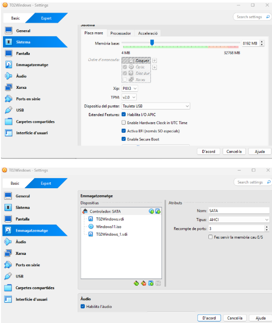
  
  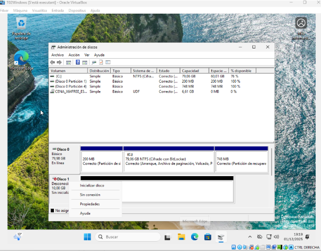
  
  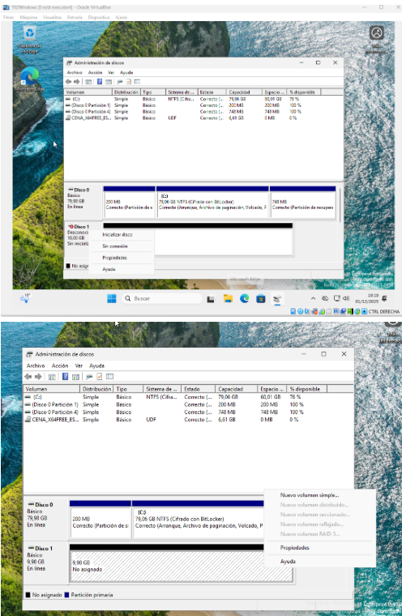
  
  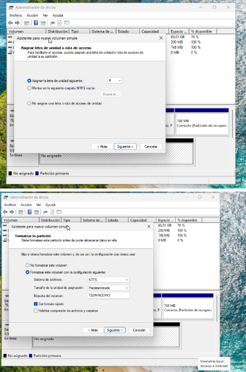
  
- **Per què?** El segon disc simula un dispositiu local dedicat a còpies de seguretat.

### Instal·lació de Duplicati
- Descarregar i instal·lar [Duplicati]
- 
  

  **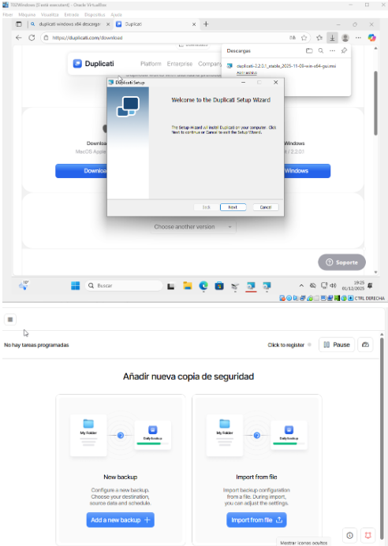

  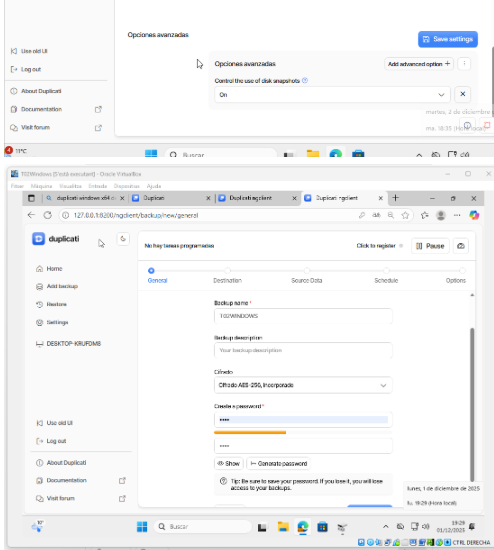
  
- **Per què?** És una eina gratuïta que permet fer còpies locals i al cloud amb programació horària.

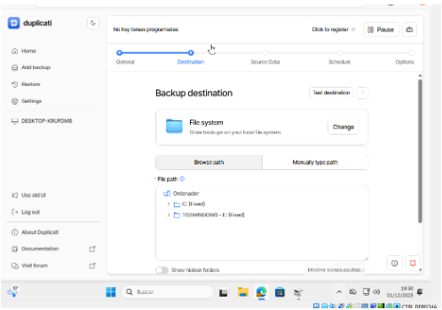

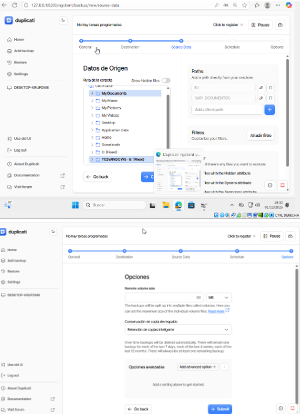

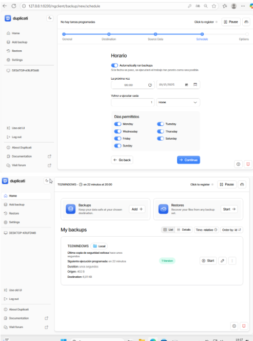

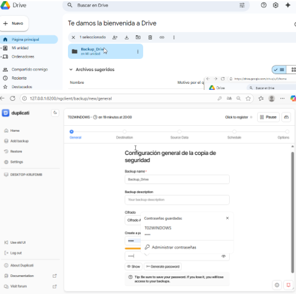

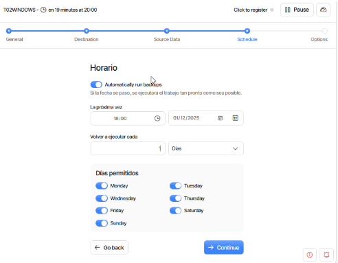

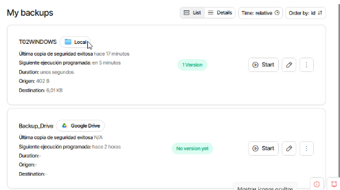

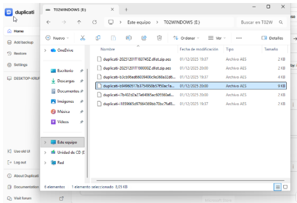

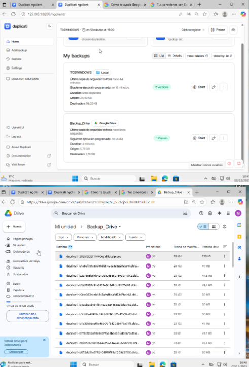

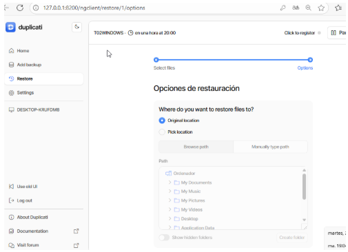

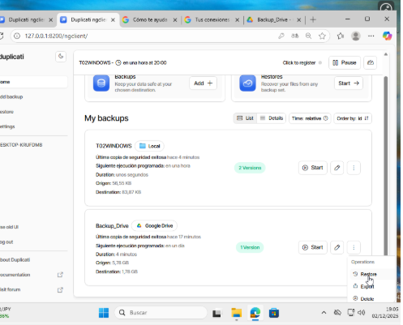

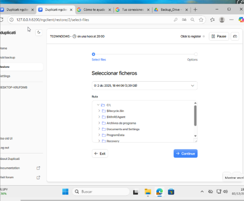

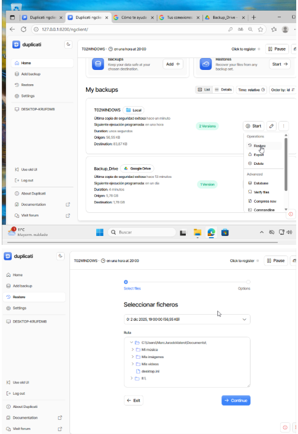

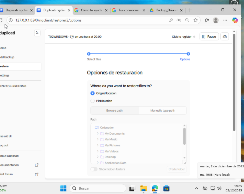

### Configuració del pla de còpies
- Crear dos plans de còpia:  
  - Cada hora → disc secundari.  
  - A les 18:00 → Google Drive (amb un compte específic).
  -
  - - **Per què?** Això segueix l’esquema **3-2-1**: 3 còpies, 2 suports diferents, 1 còpia fora de l’empresa.

### Validació del funcionament
- Afegir arxius a **Documents** i comprovar que es copien.  
- Esborrar Documents i restaurar des del disc secundari.  
- Restaurar també des de Google Drive.
  
- **Per què?** Validem que les còpies i restauracions funcionen correctament.

---

# Part 2: Còpia de seguretat servidor Linux

## Preparació de la unitat de backup

sudo mkfs.xfs /dev/sdb sudo mkdir -p /media/backup sudo mount /dev/sdb /media/backup

**Per què fem això?**  
Formategem el disc en xfs i el muntem a `/media/backup` per simular una unitat externa on es guardaran les còpies.

---

## Instal·lació de Duplicity
sudo apt update sudo apt install duplicity -y

**Per què fem això?**  
Duplicity és l’eina que permet fer còpies completes i incrementals, tant locals com remotes.

---

## Creació d’usuaris i arxius de prova

sudo adduser user01 sudo adduser user02 dd if=/dev/zero of=/home/user01/file1 bs=1M count=10 dd if=/dev/zero of=/home/user01/file2 bs=1M count=10 dd if=/dev/zero of=/home/user01/file3 bs=1M count=10 dd if=/dev/zero of=/home/user01/file4 bs=1M count=10

**Per què fem això?**  
Generem usuaris amb carpetes personals i arxius de prova per comprovar que les còpies funcionen correctament.

---

## Fer còpia de seguretat de `/home`
duplicity /home file:///media/backup

**Per què fem això?**  
Guardem una còpia completa de totes les dades dels usuaris.

---

## Restauració
duplicity restore file:///media/backup /home

**Per què fem això?**  
Comprovem que els arxius es poden recuperar des de la còpia de seguretat.

---

## Còpia incremental
dd if=/dev/zero of=/home/user01/file5 bs=1M count=4 duplicity /home file:///media/backup

**Per què fem això?**  
Només es copia el nou arxiu afegit, demostrant que la còpia és incremental.

---

## Automatització amb scripts

### fullbackup.sh
#!/bin/bash export PASSPHRASE="contrasenya" sudo mount /dev/sdb /media/backup duplicity full /home file:///media/backup sudo umount /media/backup

**Per què fem això?**  
Fem una còpia completa i assegurem que la unitat només estigui muntada durant el procés.

---

### incrementalbackup.sh
#!/bin/bash export PASSPHRASE="contrasenya" sudo mount /dev/sdb /media/backup duplicity incr /home file:///media/backup sudo umount /media/backup

**Per què fem això?**  
Fem còpies incrementals per estalviar espai i temps, mantenint la unitat desmuntada per seguretat.

---

## Programació amb cron

### Full backup (diumenge 23:00)

sudo crontab -e 0 23 * * 0 /root/fullbackup.sh

### Incremental backup (dilluns-dissabte 23:00)
sudo crontab -e 0 23 * * 1-6 /root/incrementalbackup.sh

**Per què fem això?**  
Automatitzem les còpies per garantir que es facin sense intervenció manual i sempre a la mateixa hora.

---

## Conclusions
- Amb Duplicity hem configurat còpies completes i incrementals al servidor Linux.  
- Els scripts garanteixen que la unitat de backup només estigui muntada durant la còpia.  
- Amb cron automatitzem el procés, assegurant còpies fiables cada dia.  

