## Introducció
El client **Muntatges i Serveis Tècnics SL** necessita una política de còpies de seguretat robusta.  
S’han definit dues parts:  
1. Còpia de seguretat en un **equip Windows 11** amb Duplicati.  
2. Còpia de seguretat en un **servidor Ubuntu Linux** amb Duplicity i cron.  

---

## Part 1: Còpia de seguretat dels equips clients Windows

Creació de la VM amb Windows 11
Es mostra la configuració inicial de la màquina virtual.  
**Per què?** Necessitem un entorn Windows per simular un client real.
  
  
  
  
  
  

Afegir un segon disc de 10 GB
Es veu com s’afegeix un disc addicional.  
**Per què?** Aquest disc simula el dispositiu local dedicat a còpies de seguretat
  
 

Instal·lació de Duplicati
Captures de la descàrrega i instal·lació.  
**Per què?** Duplicati és l’eina que permet fer còpies programades i xifrades
  

Primera execució de Duplicati
Es mostra la interfície web.  
**Per què?** Aquí es configuren els plans de còpia.

Configuració del destí de còpia (disc secundari)
Es defineix on es guardaran les còpies.  
**Per què?** Validem que el disc extra funciona com a repositori local.

Configuració del destí de còpia (Google Drive)
Es connecta amb un compte de Google Drive.  
**Per què?** Complim la regla 3-2-1: tenir una còpia fora de l’empresa.

---

# Part 2: Còpia de seguretat servidor Linux
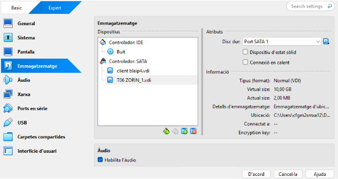

Detectar el disc nou amb lsblk
Es veu /dev/sdb de 10 GB.  
**Per què?** Identifiquem el disc on farem les còpies.

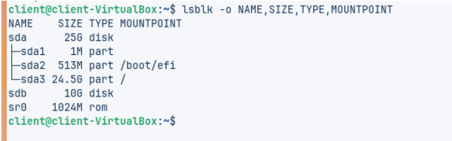

Particionar amb parted
Es crea una partició XFS.  
**Per què?** Necessitem un sistema de fitxers robust per backups.

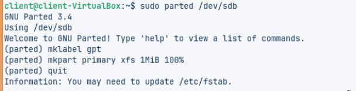

Formatar amb mkfs.xfs
Es formata la partició.  
**Per què?** Preparar el disc per emmagatzemar dades.

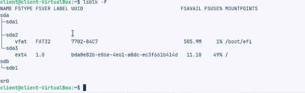

Muntar el disc a /media/backup
Es crea i munta el punt de muntatge.  
**Per què?** És el destí de les còpies.

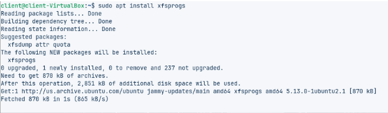

Instal·lació de duplicity i xfsprogs
Es confirma que els paquets estan instal·lats.  
**Per què?** Són les eines necessàries.

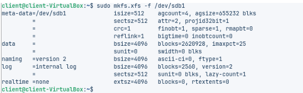

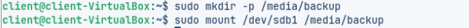

 Creació d’usuaris de prova (usuari1, usuari2)
Es creen comptes addicionals.  
**Per què?** Simulem un entorn multiusuari.

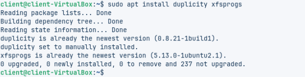

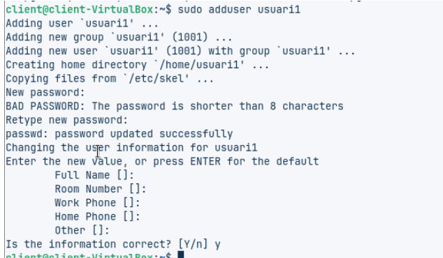

Creació de fitxers de prova amb fallocate
Es generen fitxers de 10 MB.  
**Per què?** Serviran per validar les còpies.

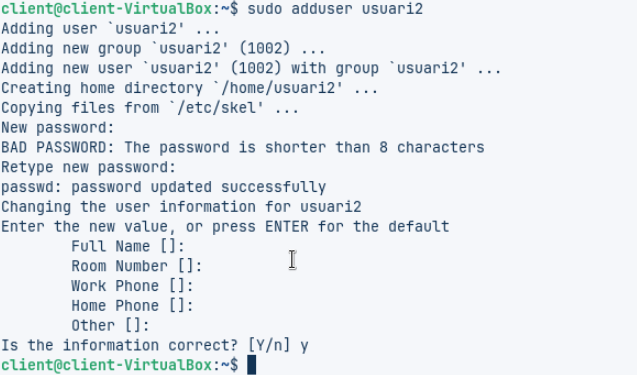

Primera còpia completa amb duplicity
Es fa backup de /home.  
**Per què?** Punt de partida de la cadena de còpies.

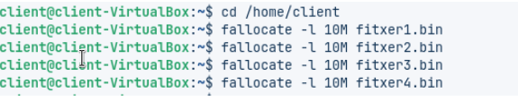

Restauració de fitxers
Es prova de restaurar fitxers esborrats.  
**Per què?** Validar que la còpia és usable.

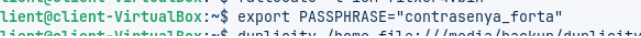

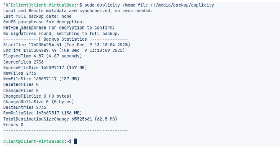

Còpia incremental
Es crea un fitxer nou i es fa backup incremental.  
**Per què?** Comprovem que només es copien els canvis.

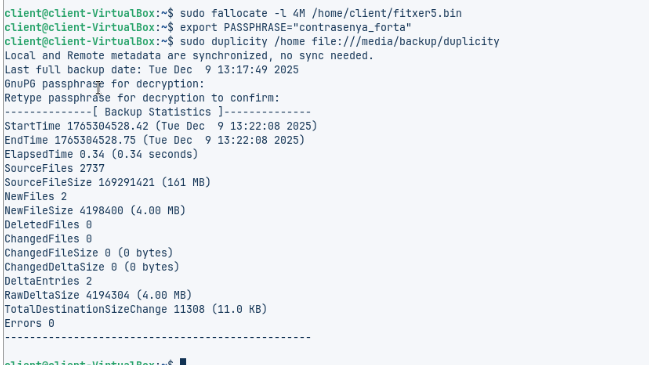

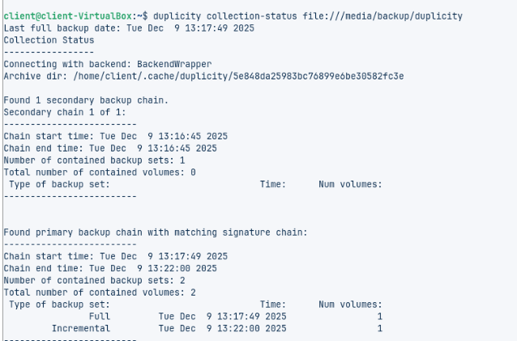

Estat de la col·lecció (collection-status)
Es mostra que hi ha còpia completa + incremental.  
**Per què?** Validació de la cadena de còpies.

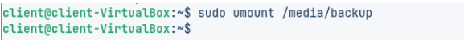

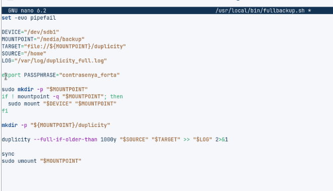

Script fullbackup.sh
Es veu el contingut de l’script.  
**Per què?** Automatitza la còpia completa

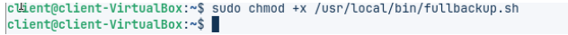

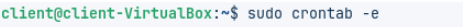

Script incrementalbackup.sh
Es veu el contingut de l’script.  
**Per què?** Automatitza les còpies incrementals.

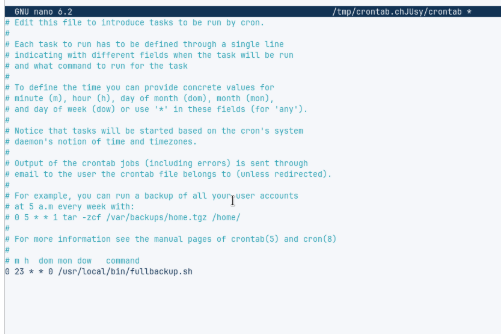

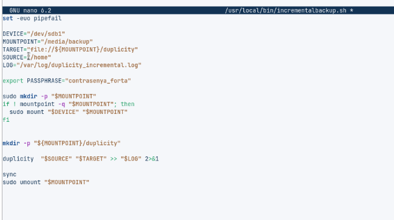

Configuració de cron
Es programen les execucions.  
**Per què?** Garantir còpies automàtiques cada dia.

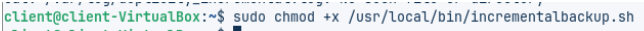

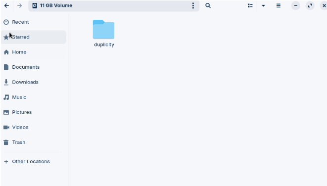

Fitxers de backup al disc
Es mostren els .difftar.gpg i manifests.  
**Per què?** Evidència que les còpies s’han fet.

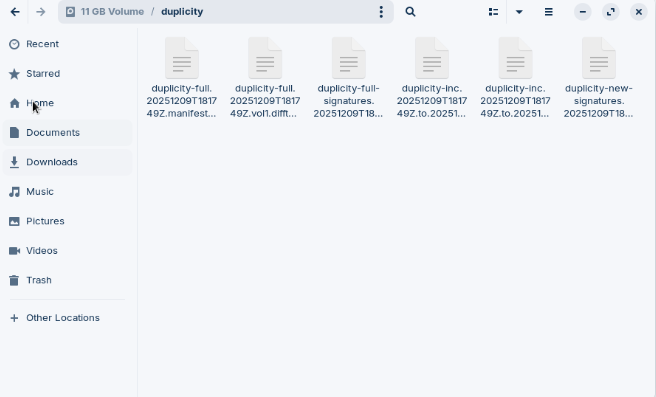

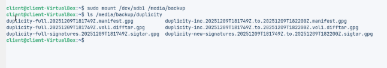

Comprovació amb collection-status
Es confirma la còpia completa i incremental.  
**Per què?** Validació final.

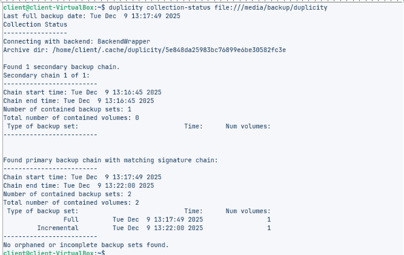

Restauració puntual d’un fitxer
Es prova de recuperar fitxer1.bin.  
**Per què?** Validar restauració selectiva.

---

## Conclusions
- Amb Duplicity hem configurat còpies completes i incrementals al servidor Linux.  
- Els scripts garanteixen que la unitat de backup només estigui muntada durant la còpia.  
- Amb cron automatitzem el procés, assegurant còpies fiables cada dia.  

