# 

# **Accés Remot. Connexió via SSH**

# **configuració ssh  Servidor Ubuntu server i configuració ssh i client Windows, tunel i wireshark**

# 

# 

# 

# **![][image1]**

Marc Jurado CFGMSMXA  
Xarxes Blai redondo

# **T05: Accés Remot. Connexió via SSH (tasca individual)**

\-L’objectiu d’aquesta tasca sera conectarse desde un servidor ssh de linux en el meu cas, a client windows en ssh.  
**\-Veurem la configuració bàsica del servidor**, el procés de connexió i accions que es poden realitzar.  
**\-A continuació, veurem els túnels SSH** com a mètode d’assegurar d’una connexió.  
**\-Finalment, veurem com usar el servei SSH** per fer una connexió des d’un equip Linux a una màquina Windows.

**• Per instal·lar ssh hem de fer:**  – `apt install ssh`  
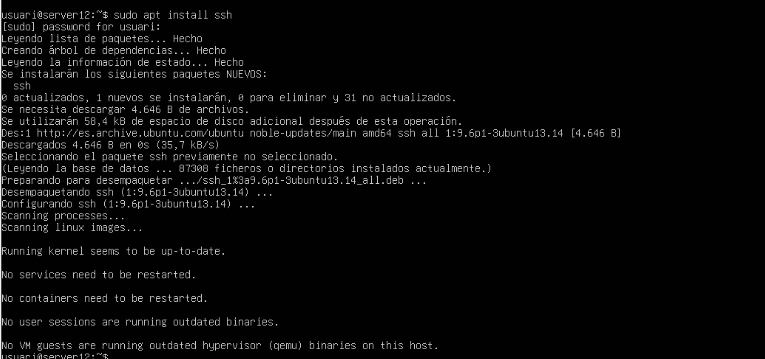

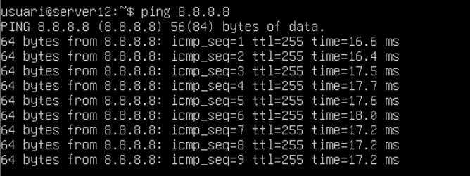
**•Mirem si tenim internet a traves del:**  – `ping 8.8.8.8`

**•Mirem si tenim internet a traves del:**  – `ping google.es`  
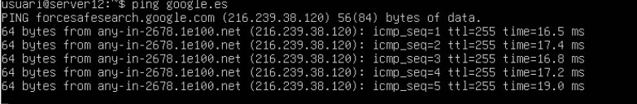

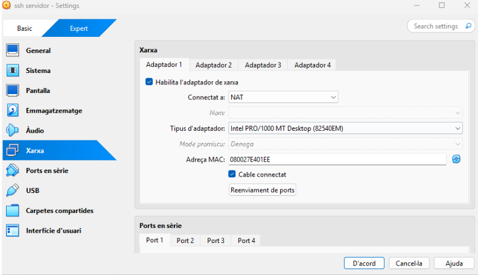
**•Primer adaptador haurà de ser en NAT:**  – `canviar la configuració a paràmetres i xarxa adaptador 1`  
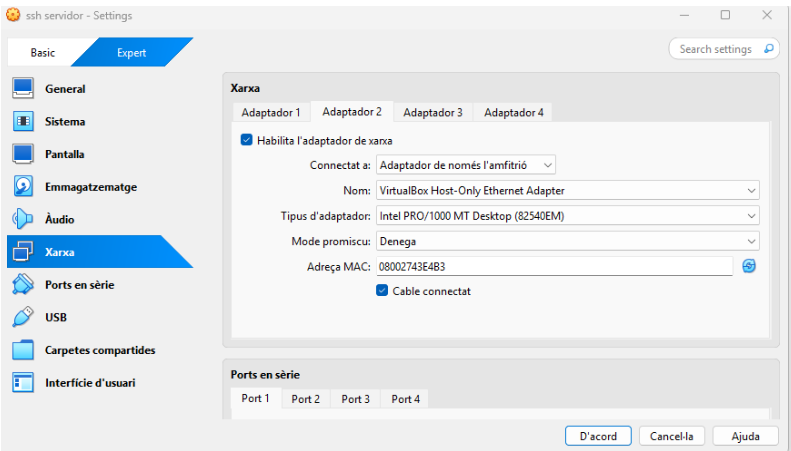 
**•Segon adaptador haurà de ser en amfitrió:**  – `canviar la configuració a paràmetres i xarxa adaptador 2`

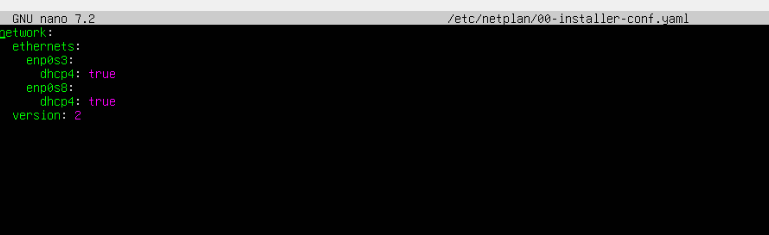
**•Configuració de xarxa en el netplan :**  – `canviar la configuració de xarxa, - sudo nano /etc/netplan/00-installer.conf.yaml, posant un adaptador mes en true que es el de enp0s8`

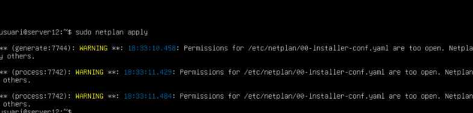  
**•Apliquem els canvis del arxiu de xarxa:**  – `sudo netplan apply, han de sortir les tres activades`  
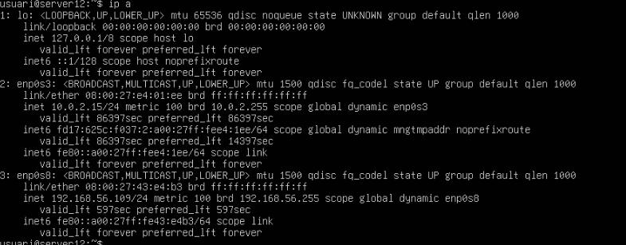 
**•Veure les IP per configurar el ssh en el meu cas la del enp0s8 (amfitrió):**  – IP A, veure la ip del servidor la primera que es enp0s3

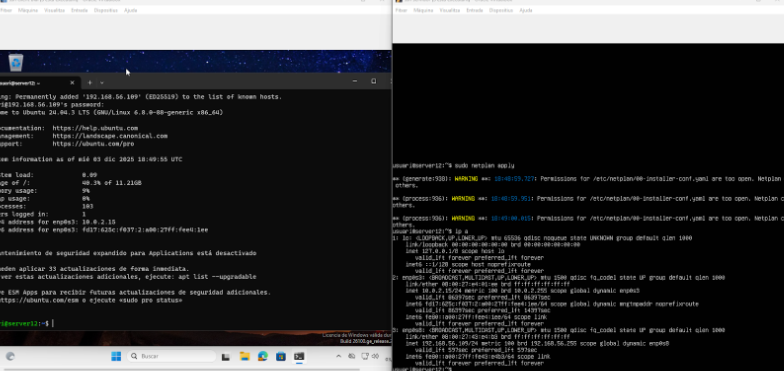  
**•Comprovació de connexió amb SSH :**  – `desde el client configurar el ssh -ssh usuari@192.168.56.109 posem la contrasenya i ja estem a dins, hem de veure la pantalla de la dreta que es la que te la ip, usuari es el nom del usuario del servidor`

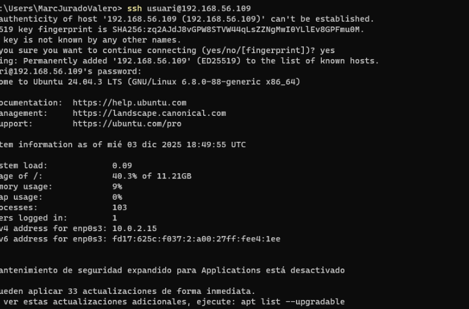
**•Captura vista en gran :**  `-ssh usuari@192.168.56.109`![][image12]  
**•Mes configuració amb un ping al servidor 12 el meu i funciona :**  `-ping server12`  
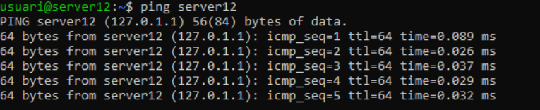 
**•Per veure el nom del servidor correcte :**  `-hostname -f`  
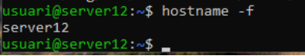
**•Obrir l'arxiu de ssh  :** `-sudo nano /etc/ssh/sshd_config`  
**•afegim una linia  :** `-PermitRootLogin no`  
**•afegim una linia  :** `AllowUsers usuari`  
**el que volem es que no entri un usuari 2 a i només tingui accés el usuari normal**  
**Per exemple podem permetre o no connexions de root o canviar el port de connexió (per defecte el 22\)**

**•El principal funcionament d'aquest arxiu per la tasca:**

**Podem fer una llista d’usuaris autoritzats per fer connexió remota afegint la línia:  – `AllowUsers` usuaris permesos separats amb comes**  
**Per defecte, tots els usuaris poden iniciar sessió remota**  
**– Desactiva l’accés al root**   
**– Crea un nou usuari `usuari2`. Configura SSH perquè només es pugui connectar `usuari` i comprova que `usuari2` no té connexió**

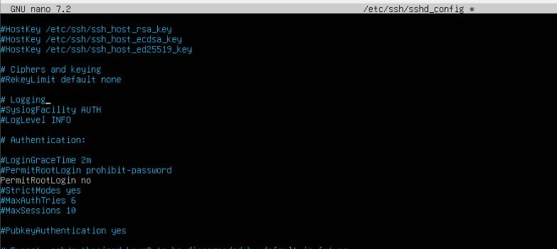  

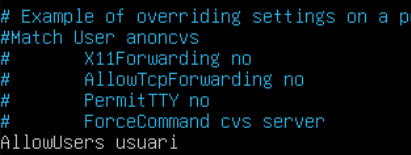  
**–reiniciar el servei ssh perquè funcioni:** `-sudo systemctl restart ssh`

  
**–veurem el status si funciona del ssh i:** `-sudo systemctl status ssh`

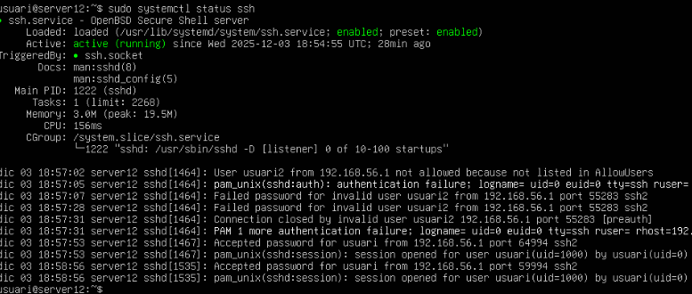  
**– Com ve ja hem dit abans l tasca ens diu que hem de crear un nou usuari `usuari2`. Configura SSH perquè només es pugui connectar `usuari` i comprova que `usuari2` no té connexió**  
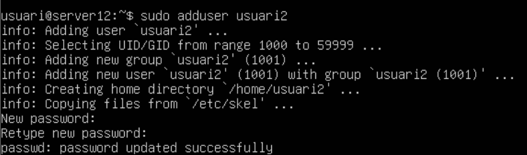  
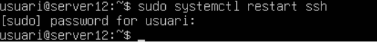  
**– Com veiem aqui si entrem amb ssh usuari2”192.168.56.109 no funcionara perque hem escrit al arxiu de** `-sudo nano /etc/ssh/sshd_config`  **veiem aquí que usuari2 no te connexió amb ssh perquè en arxiu hem posat que  només tingui permís el usuari i si entra un altre no el deixa.**  
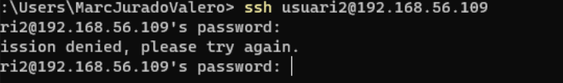  
**I ara com veiem aquí al entrar amb ssh al client amb usuari ens deixi completament entrar**  
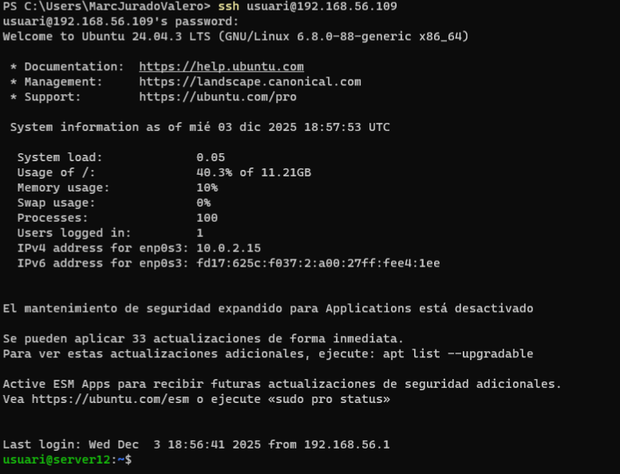 
**Configurarem un túnel amb redirecció dinàmica (dynamic forwarding) que utilitzarem per redirigir el trànsit.**  `-ssh -D 9876 usuari@192.168.56.109`  
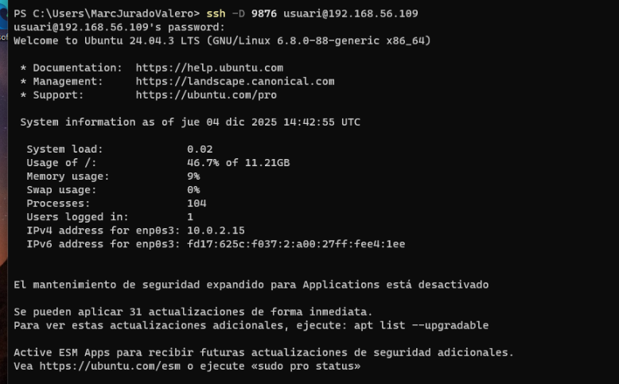  
**Configurarem un túnel amb propiedades de internet anirem a les conexiones, configurarem la LAN, li direm que utlitzi servidor proxy per la LAN i veurem que hem de configurar el tunel amb el 9876**  
Perque fem servir proxy i que es?  
Aquesta configuració permet redirigir tot el trànsit de xarxa a través d’un servidor proxy local (127.0.0.1:9874), sovint utilitzat amb túnels SSH dinàmics. Això serveix per assegurar connexions o simular accés des d’una altra ubicació. És útil per navegar de forma privada, accedir a recursos restringits o analitzar trànsit amb eines com Wireshark.  
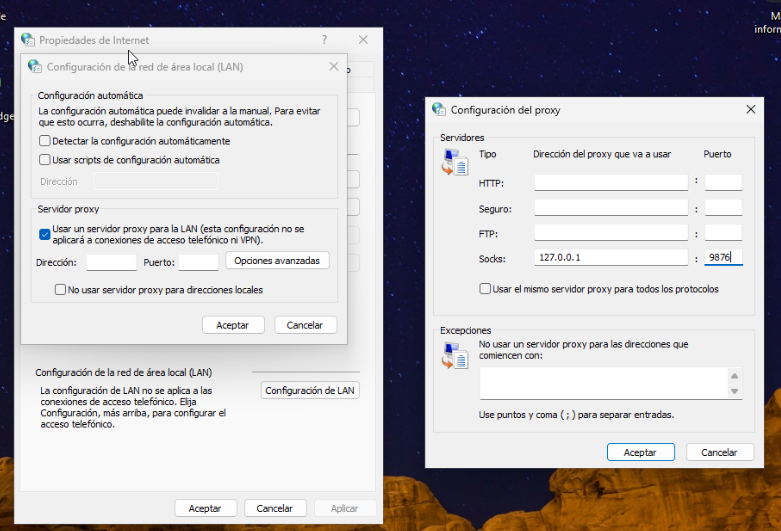  
**Instalar el wireshark a el nostre client i veurem quins paquets i a qui li envia els paquets a cada un desde servidor al client**

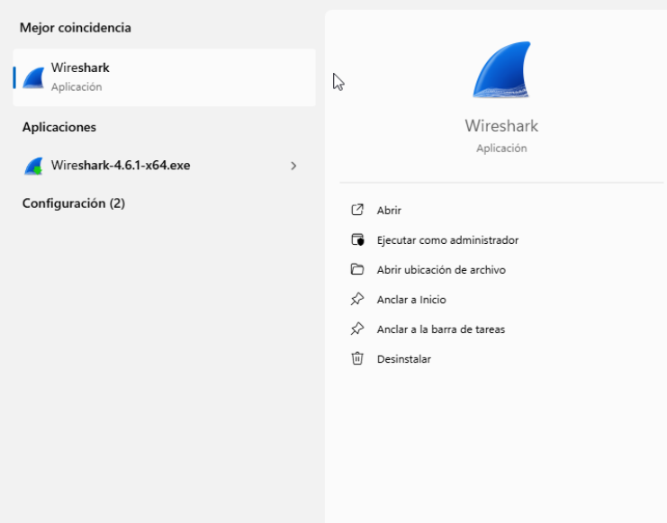
**Com correctament veiem el wireshark funciona envia els paquets de ssh de servidor a client desde la ip nostre i la del servidor seguidament**

**\-Aquesta captura mostra paquets SSH capturats amb Wireshark entre dues IPs, indicant comunicació segura. Cada paquet està xifrat, per això només veiem “Encrypted packet” i no el contingut. Serveix per verificar que la connexió SSH està activa i que el trànsit viatja protegit.**  
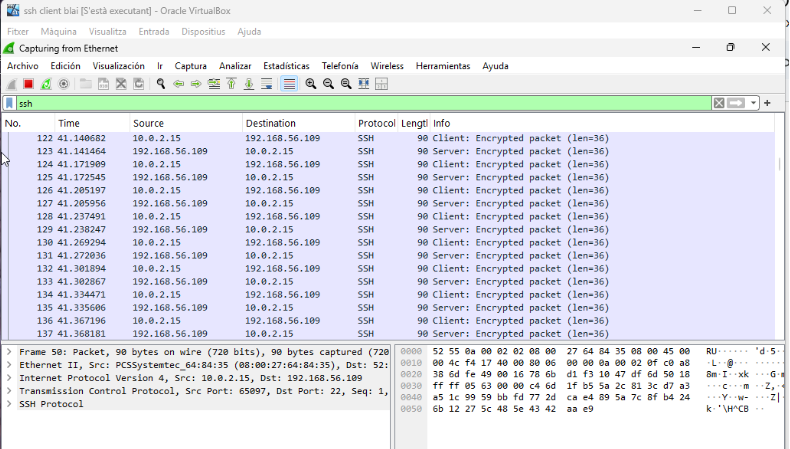  
 
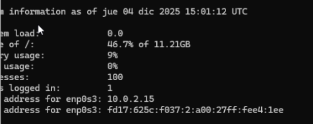 
**Com correctament veiem la nostra IP servidor 192.168.56.109 i la del client que es  10.0.2.15**

INICIAR SESSIÓ AMB SSH KEYS  
Permetre que el teu equip Windows es connecti al servidor Linux via SSH **sense contrasenya**, utilitzant **autenticació amb clau pública**. Això és més segur i còmode que usar contrasenyes.  
**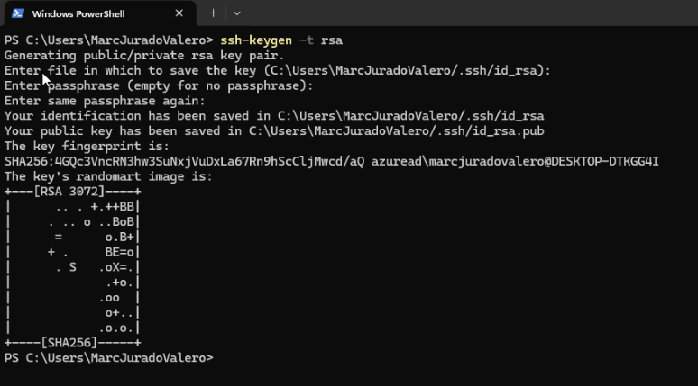
Crea una parella de claus: **clau privada (**`id_rsa`**)** i **clau pública (**`id_rsa.pub`**)**.  
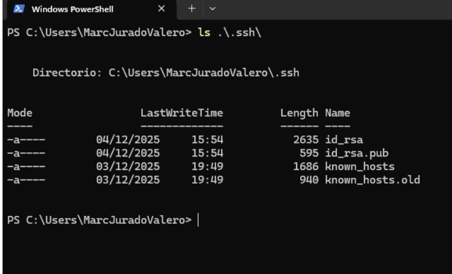  
Verificar que les claus s’han creat  
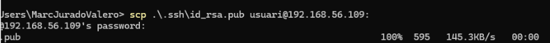 
Usa `scp` (secure copy) per enviar la clau pública al servidor.  
Et demana la contrasenya de l’usuari del servidor (només aquesta vegada).  
La clau es copia al directori personal del servidor.

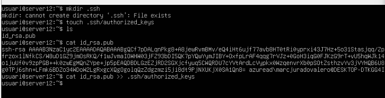 
Crea el directori `.ssh` si no existeix.  
Afegeix la clau pública al fitxer `authorized_keys`.  
Ajusta els permisos per seguretat.

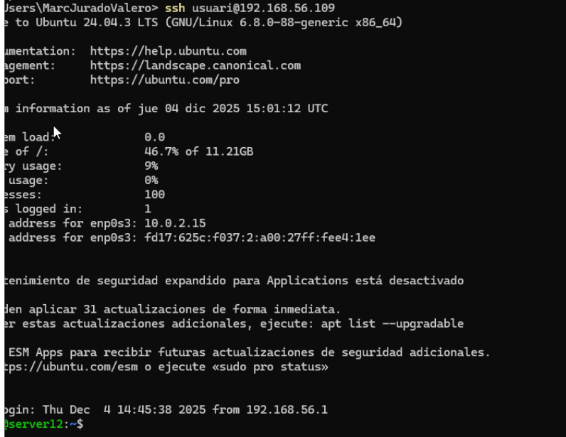  
Ara la connexió s’hauria de fer **sense demanar contrasenya**

