# 🗂️ Servidor de fitxers Linux amb NFS

Aquesta guia documenta pas a pas la configuració d’un servidor NFS a Ubuntu Server i la connexió des d’un client Linux (Zorin OS). Inclou explicacions de cada acció i captures numerades.

## Preparació de l'entorn
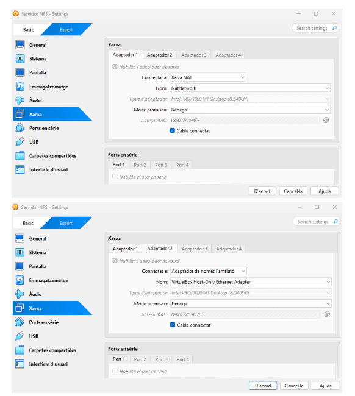

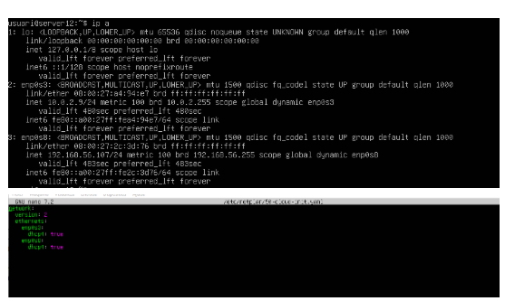

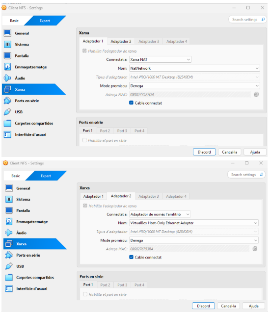

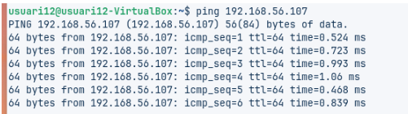

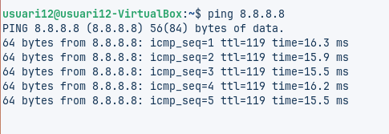

---

## 1. Creació de grups i usuaris

sudo groupadd devs
sudo groupadd admins
sudo useradd -m -s /bin/bash -G devs dev01
sudo useradd -m -s /bin/bash -G admins admin01
sudo passwd dev01
sudo passwd admin01

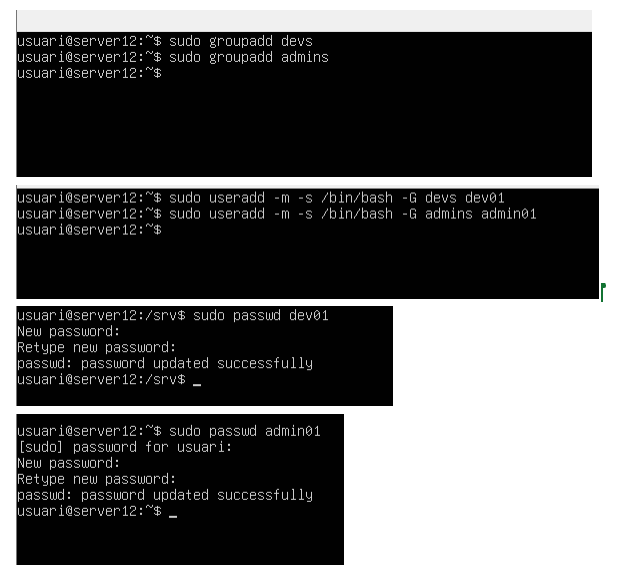

Creem grups (devs, admins) per separar rols i permisos. Els usuaris dev01 i admin01 pertanyen a aquests grups, cosa que ens permet controlar qui pot accedir i modificar els recursos compartits.

2. Creació de directoris compartits
sudo mkdir -p /srv/nfs/dev_projects
sudo mkdir -p /srv/nfs/admin_tools
sudo chown root:devs /srv/nfs/dev_projects
sudo chmod 770 /srv/nfs/dev_projects
sudo chown root:admins /srv/nfs/admin_tools
sudo chmod 770 /srv/nfs/admin_tools

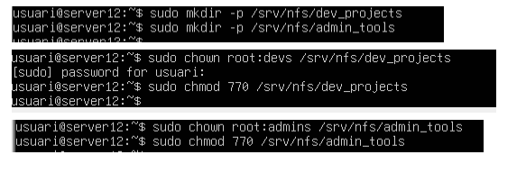

Definim els directoris que es compartiran via NFS. Assignem propietaris i permisos perquè només els membres dels grups corresponents puguin escriure-hi. Això garanteix seguretat i organització.

3. Instal·lació del servidor NFS

sudo apt install nfs-kernel-server -y

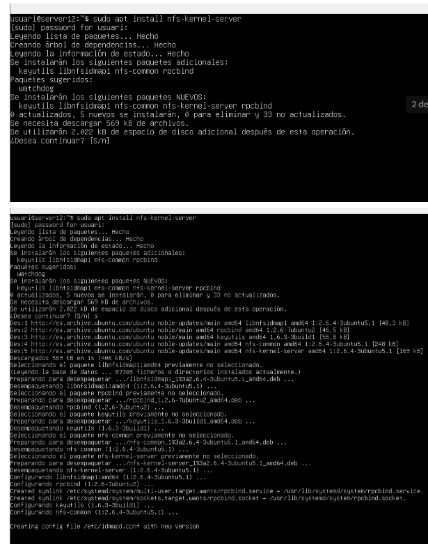

El paquet nfs-kernel-server és el servei que permet exportar directoris a la xarxa. Sense ell, el servidor no pot compartir carpetes amb els clients.

4. Configuració de les exportacions
Editem /etc/exports:

/srv/nfs/admin_tools 192.168.56.0/24(rw,sync,no_root_squash)
/srv/nfs/dev_projects 192.168.56.0/24(rw,sync,no_root_squash)

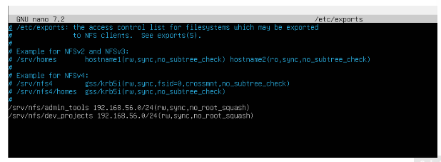

Aquí definim quins directoris es comparteixen i amb quins permisos.

rw: lectura i escriptura

sync: sincronització immediata

no_root_squash: permet que root al client mantingui privilegis

5. Activació del servei
sudo systemctl start nfs-kernel-server
sudo systemctl reload nfs-kernel-server
sudo exportfs -ra
sudo systemctl enable nfs-kernel-server

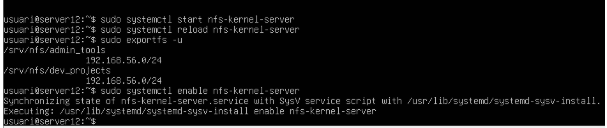

Reiniciem i habilitem el servei perquè les exportacions entrin en vigor i el servidor NFS s’executi automàticament en cada arrencada.

7. Verificació amb rpcinfo
sudo rpcinfo -p 192.168.56.107

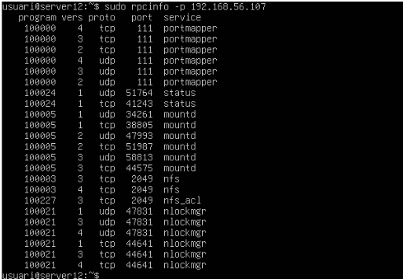

Comprovem que els serveis NFS (portmapper, mountd, nfs) estan actius i escoltant als ports correctes. És una validació tècnica que el servidor funciona.

9. Configuració del client Linux
sudo apt update
sudo apt install nfs-common -y

El client necessita el paquet nfs-common per poder muntar directoris NFS. Sense aquest paquet, no pot connectar-se al servidor.

11. Comprovació de les exportacions
showmount -e 192.168.56.107

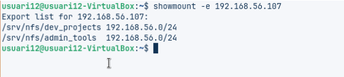

Mostra els directoris que el servidor exporta. Ens assegura que el client veu correctament els recursos compartits.

13. Muntatge manual
sudo mkdir -p /mnt/admin_tools
sudo mount -t nfs 192.168.56.107:/srv/nfs/admin_tools /mnt/admin_tools

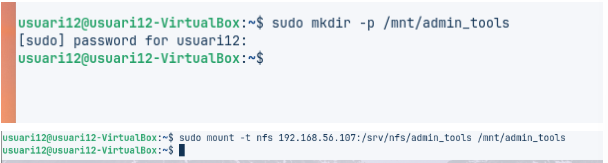

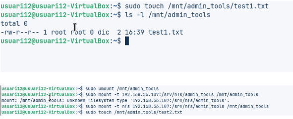

sudo mkdir -p /mnt/dev_projects
sudo mount -t nfs 192.168.56.107:/srv/nfs/dev_projects /mnt/dev_projects

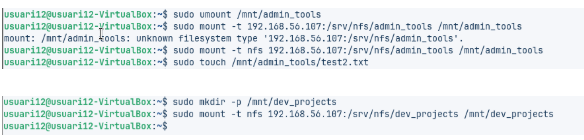

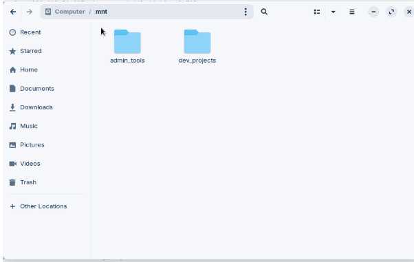

Muntem els directoris compartits al client per accedir-hi com si fossin locals. Això permet treballar amb fitxers de manera transparent.

10. Muntatge automàtic amb /etc/fstab
Afegim al fitxer /etc/fstab:

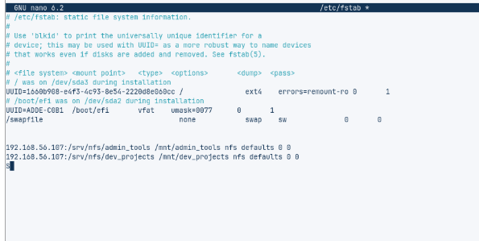

192.168.56.107:/srv/nfs/admin_tools /mnt/admin_tools nfs defaults 0 0
192.168.56.107:/srv/nfs/dev_projects /mnt/dev_projects nfs defaults 0 0
Amb aquesta configuració, els directoris NFS es muntaran automàticament cada cop que el client reiniciï. Evita haver de muntar-los manualment.

11. Validació final

sudo reboot
mount | grep nfs

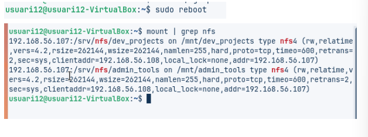

Reiniciem el client i comprovem que els directoris NFS apareixen muntats correctament. És la validació final que tot funciona.

# Conclusió NFS

Hem muntat un servidor NFS perquè tots tinguin els fitxers al mateix lloc.  
Així evitem que cada persona tingui còpies diferents i es perdi temps.  
Els grups i permisos fan que només qui toca pugui escriure o llegir.  
També hem vist el tema del root_squash i com afecta al root del client.  
Funciona bé, però en el futur caldria posar més seguretat i control d’usuaris.

